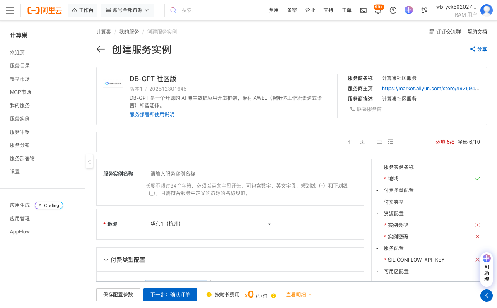

# DB-GPT社区版服务实例使用文档

## 概述

DB-GPT 是一个开源的 AI 原生数据应用开发框架，带有 AWEL（智能体工作流表达式语言）和智能体。该框架旨在帮助开发者快速构建基于大模型的数据应用，提供了一套完整的工具链和组件，支持数据连接、查询优化、结果展示等功能。

## 部署操作流程

1. 点击链接：[部署链接](https://computenest.console.aliyun.com/service/instance/create/cn-hangzhou?type=user&ServiceId=service-136e48b2f72f4a50b416)，进入服务实例部署界面，根据界面提示，填写参数。
    
2. 查看价格明细，确认资源配置和费用信息。
3. 点击"下一步：确认订单"按钮进入订单确认页面。

4. 点击创建实例按钮，开始部署服务实例。

5. 等待服务实例创建完成，系统会自动分配公网访问地址。

6. 点击公网访问地址使用服务，您将看到DB-GPT的Web界面。
    

## 官方网站
更多信息请访问官方文档：[官网链接](http://docs.dbgpt.cn/docs/overview/)